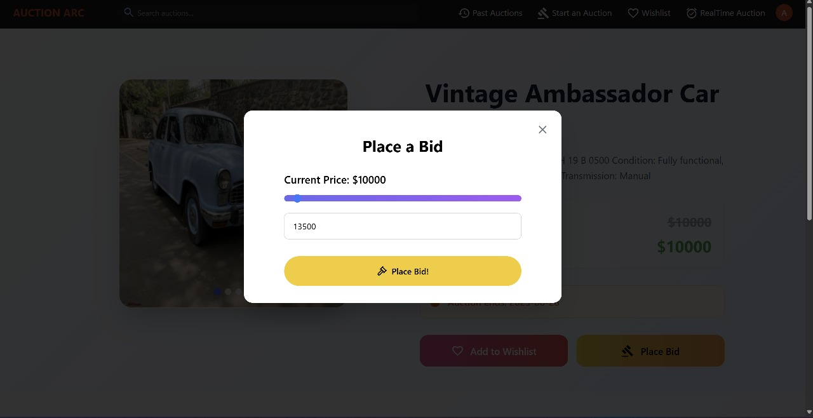

# AuctionARC

<p style="text-align: center">  </p>

Welcome to Auction Arc's Repository 🥳! This is a **hobby project** made **Hardik Mutha** and **Aryan Mehta** to explore and refine our skills in fullstack development.

## What is Auction Arc?

Auction Arc is a place where anyone from the world can log on and offer their product for sale. It is focussed on auctions where users can bid until a certian date, after which the product is sold to the highest bidder.

## Features

- ### Live Bidding System

  - Real-time bid updates using WebSockets or polling

  - Dynamic bid history per product

  - Bid validation based on current highest bid and auction timing

- ### Product Listings

  - Sellers can create and delete auction items

  - Upload multiple images with product details (title, description, base price, etc.)

  - Set auction end times

- ### User Authentication

  - Secure sign-up and login

  - JWT-based session handling

  - Role-based access control (e.g., admin, seller, bidder)

- ### Bid Management

  - Bidders can view their active and past bids in dashboard

  - Each product stores an array of bid IDs for quick access

  - Admins/sellers can monitor bid activity

- ### Auction Timer

  - Countdown timers on product pages

  - Automatic auction status update once time expires

- ### Wishlist

  - Users can bookmark auctions they're interested

## 💻 Running the Project Locally

Follow these steps to set up and run the project on your local machine:

### 1. Clone the Repository

```bash
git https://github.com/HardikMutha/AuctionArc.git
cd AuctionArc
```

### 2. Install Dependencies

#### Client

```bash
cd client
npm install
```

#### Server

```bash
cd ../server
npm install
```

### 3. Set Up Environment Variables

Create a `.env` file in both the `client` and `server` directories.

#### Server (`server/.env`)

```
PORT=8080
MONGO_STRING=<YOUR_MONGO_DB_STRING>
SECRET_HASH_STRING="secret string here"
CLOUDINARY_CLOUD_NAME=<YOUR_CLOUDINARY_NAME>
CLOUDINARY_API_KEY=<YOUR_CLOUDINARY_API_KEY>
CLOUDINARY_API_SECRET=<YOUR_CLOUDINARY_API_SECRET>
```

#### Client (`client/.env`)

```
SECRET_HASH_STRING="theslyfoxjumpedoverthelazydog"
VITE_BACKEND_URL="http://localhost:8080"
VITE_SUPABASE_URL=<YOUR_SUPABASE_URL>
VITE_SUPABASE_ANON_KEY="<YOUR_SUPABASE_ANONYMOUS_KEY>"
```

### 4. Start the Development Servers

#### Backend

```bash
cd server
npm start
```

#### Frontend

```bash
cd ../client
npm run dev
```

The client will be available at [http://localhost:5173](http://localhost:5173) and will communicate with the backend at `http://localhost:8080`.

## **PROJECT TOUR**

1. **Signup**
   

2. **Place Bid**
   

3. **Sold Product**
   

4. **Live Auction Interface**
   

5. **Finish Live Auction**
   

## Tech Used

1. **Frontend** -- React, Tailwind CSS, TypeScript
2. **Backend** -- Express, JWT, MongoDB,Node.js
3. **Realtime** -- Supabase Realtime
4. **Deployment** -- Vercel

<h6>Special mention to claude for helping out with designs and color scheme</h6>

## 🤝 Contributing

We welcome contributions from the community! If you'd like to help improve this project, follow the steps below to get started:

### 🛠️ Setup Instructions

1. **Fork this repository** and clone it locally:

   ```bash
   git clone https://github.com/YOUR_USERNAME/YOUR_FORK.git
   cd YOUR_FORK

   ```

2. Follow the instructions above to run the project locally

## 🙌 How to Contribute

- Create a new branch for your feature or bug fix:

```bash
git checkout -b feature/your-feature-name
```

- Make your changes and ensure everything works as expected.

- Commit your changes with a clear message:

```bash
git commit -m "Add your message here"
```

- Push your branch to your fork:

```bash
git push origin feature/your-feature-name
```

- Open a Pull Request from your branch to the main branch of the original repository.

- Describe your PR clearly — mention what you changed, why you did it, and any issues it closes.

- Any Improvements in UI/UX or color-schemes are encouraged as designing is not our forte.

## 💡 Tips for Contributing

- Make sure your code follows the project's coding standards.

- Add tests for new features or bug fixes.

- Document your code where necessary.

- Create clear, descriptive commit messages.
